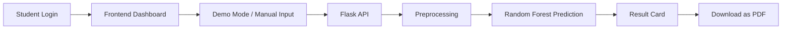
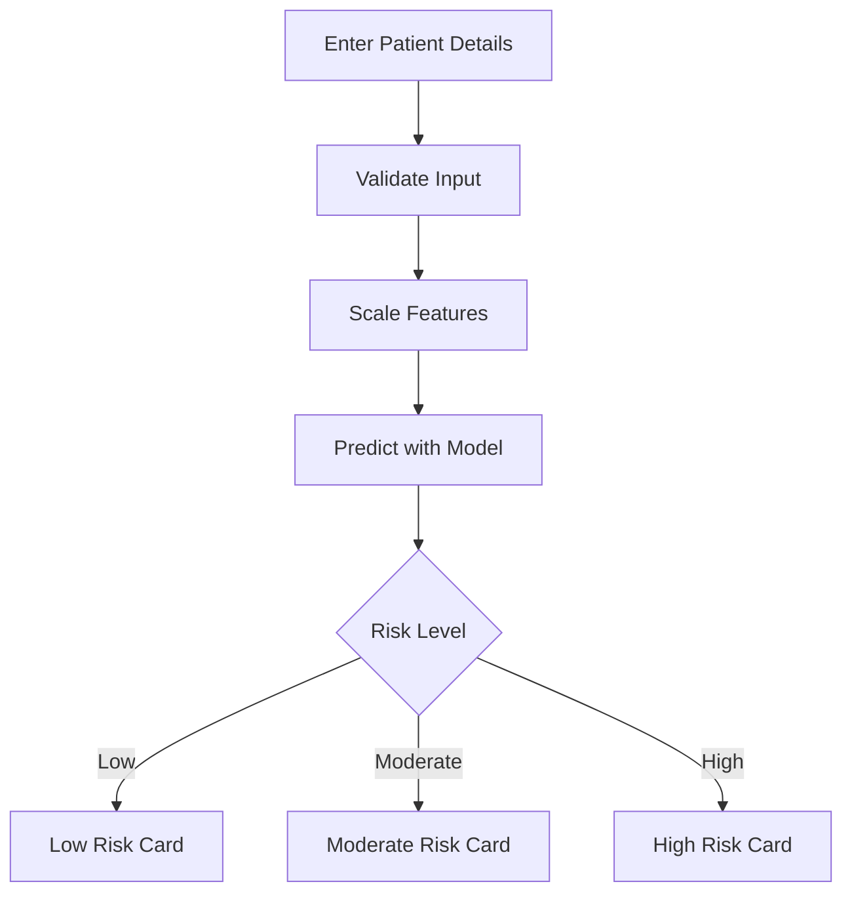
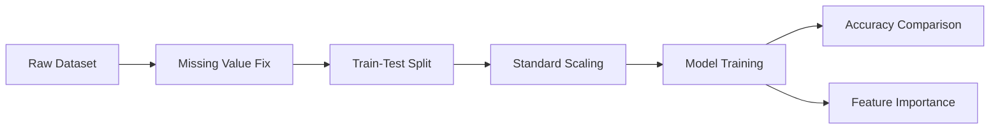

# Diabetes Risk Prediction OEP Website

This project is a complete web presentation of the final OEP work on diabetes risk prediction. It combines a modern frontend, a Flask backend, machine learning model training, demo mode, a printable result card, and presentation-friendly branding.

## Project Title

Healthcare Data Analytics for Disease Risk Prediction

## Problem Statement

Predict whether a patient is likely to have diabetes based on clinical measurements such as glucose, BMI, blood pressure, insulin, age, and related health indicators.

## Project Objective

- Analyze the Pima Indians Diabetes dataset.
- Train multiple machine learning models.
- Compare model performance.
- Build a web application for live prediction.
- Show the result in a professional format for viva or class presentation.

## Dataset Used

- Dataset: Pima Indians Diabetes Database
- Source: Public CSV from GitHub
- Features used:
  - Pregnancies
  - Glucose
  - BloodPressure
  - SkinThickness
  - Insulin
  - BMI
  - DiabetesPedigreeFunction
  - Age
- Target:
  - Outcome

## Machine Learning Models

The website compares three models:

- Logistic Regression
- Decision Tree
- Random Forest

The final prediction engine uses Random Forest because it is usually more robust for this dataset.

## Data Processing Steps

1. Load dataset from a public CSV link.
2. Replace impossible zero values with missing values in medical columns.
3. Fill missing values using median values.
4. Split the dataset into training and testing sets.
5. Standardize the features using StandardScaler.
6. Train the models.
7. Evaluate accuracy.
8. Extract feature importance from Random Forest.

## Website Features

- Student login page with name and roll number branding.
- Clean dashboard style for class presentation.
- Model comparison section.
- Feature importance section.
- Demo mode with one-click sample patients.
- Live prediction form for custom patient input.
- Result card designed for screenshots or PDF export.
- Print or Save as PDF support.

## Backend Features

The backend is built with Flask and provides:

- `/` for the homepage
- `/api/summary` for model statistics
- `/api/predict` for prediction result

## Frontend Features

- Modern layout with branded typography.
- Login gate for presentation impression.
- Sample patient buttons:
  - Low Risk
  - Moderate Risk
  - High Risk
- Visual bars for model scores and feature importance.
- Printable result summary card.

## Demo Mode Explanation

Demo mode allows quick presentation without typing values manually.

- Low Risk Sample shows a healthy profile.
- Moderate Risk Sample shows an intermediate profile.
- High Risk Sample shows a profile with strong diabetes indicators.

This is useful during viva because you can demonstrate the system in one click.

## Website Diagrams

The website shows diagrams using Mermaid, and the README includes the same diagrams for slides and report writing.

### System Architecture Diagram



### Prediction Workflow Diagram



### Data Pipeline Diagram



## Project Structure

```text
PDS/
  app.py
  pds_oep.py
  pyproject.toml
  README.md
  templates/
    index.html
  static/
    styles.css
    app.js
```

## How to Run Locally

1. Open terminal in the project folder.
1. Activate the virtual environment:

   .\.venv\Scripts\Activate.ps1

1. Install packages:

  pip install .

1. Start the web app:

   python app.py

1. Open the browser:

   [http://127.0.0.1:5000](http://127.0.0.1:5000)

## How to Use the Website

1. Enter your name and roll number.
2. Click Enter Project.
3. Use Demo Mode or fill the form manually.
4. Click Run Prediction.
5. Review the result card.
6. Click Download PDF and save the page as PDF if needed.

## Deployment Notes

Recommended platform: Render

- Build Command: `pip install .`
- Start Command: `gunicorn app:app`
- Publish Directory: leave empty or use `.` if required by the form
- Runtime file: `runtime.txt` with `python-3.11.9`

## What to Tell Sir in Presentation

- This project predicts diabetes risk from clinical features.
- Three models were trained and compared.
- Random Forest was selected for the final prediction system.
- The website supports one-click demo samples for fast demonstration.
- The result card can be exported as PDF for submission or presentation.
- The login page adds personal branding for a more professional look.

## PPT Outline

Use this README directly to make slides.

1. Title Slide
2. Problem Statement
3. Objective
4. Dataset Information
5. Workflow Diagram
6. Model Comparison
7. Feature Importance
8. Website Demo Mode
9. Prediction Result Card
10. Deployment and Conclusion

## Short Conclusion

This project turns a machine learning notebook into a complete web-based presentation system. It is suitable for classroom demonstration, viva, and final OEP submission.
